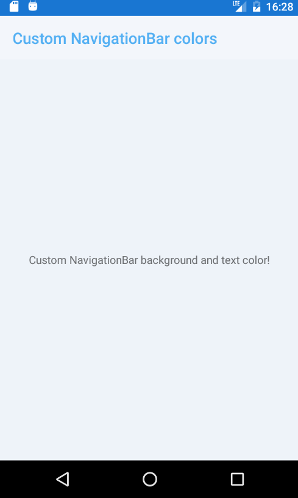
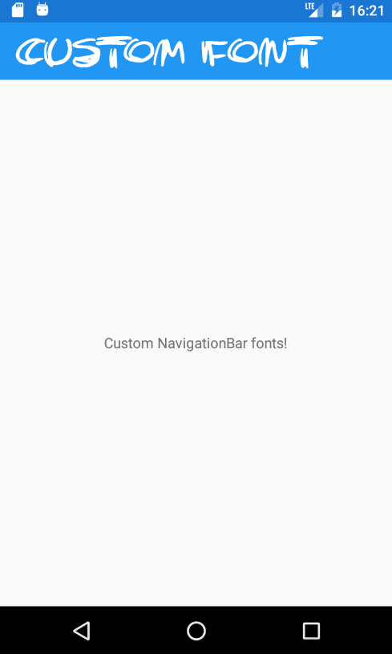
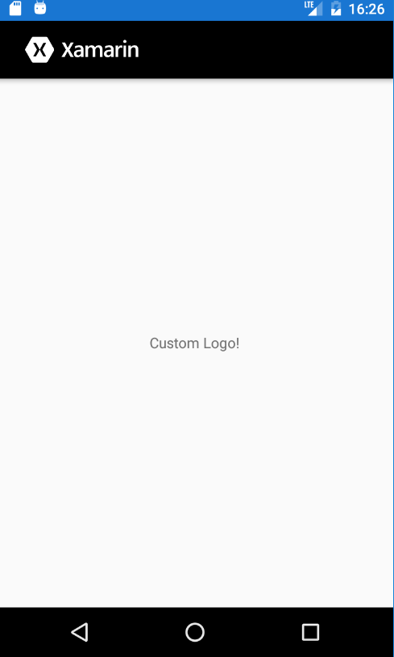

# Custom NavigationPage

Samples that show how to customize the **NavigationPage** in a Xamarin.Forms App. How to modify colors, font type or how to add a Logo.

## Custom colors

  

## Custom fonts

  

## Custom logo

  

## Setup

Download or clone the repository. There are different solutions.

Rebuild the selected solution to get all neccesary NuGet packages.

**Enjoy!**

## Licenses

This project uses some third-party assets with a license that requires attribution:

- [Trashtalk](https://www.urbanfonts.com/fonts/Trashtalk.font): Free font created by Darrell Flood.

## Copyright and license

Code released under the [MIT license](https://opensource.org/licenses/MIT).